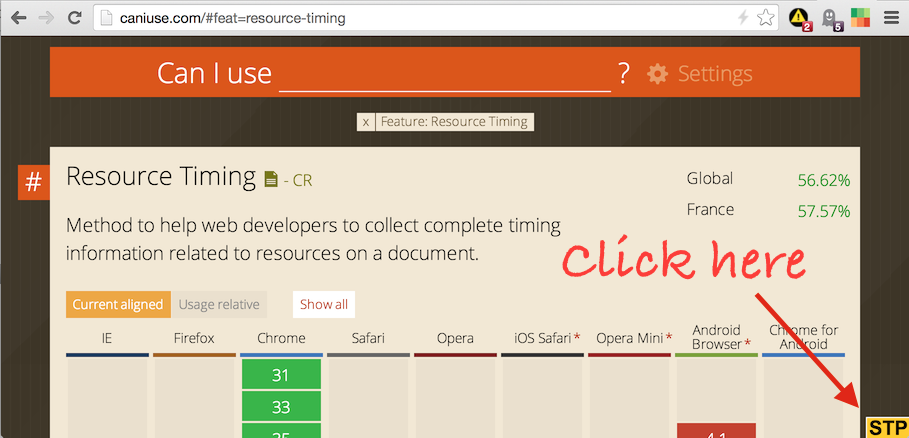
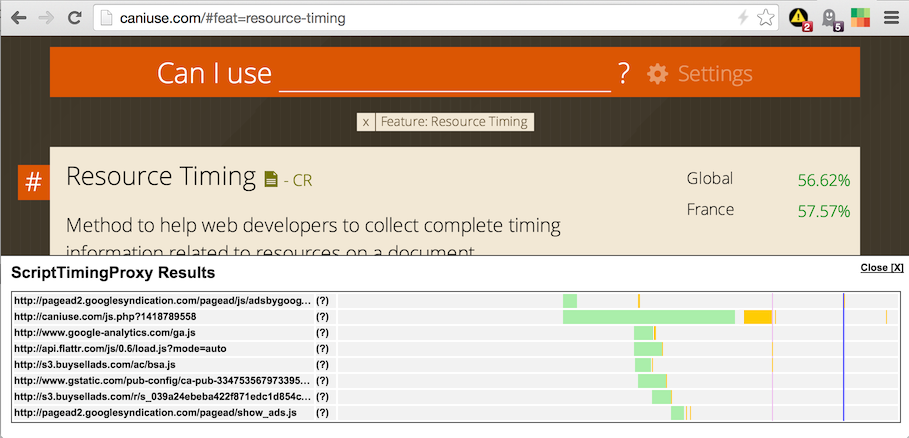
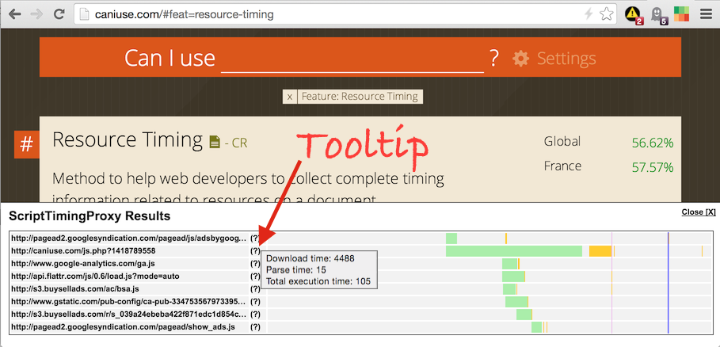

# ScriptTimingProxy

Mesure scripts parse and execution times with this simple browser proxy.


## Why should you use ScriptTimingProxy ?

You're a web developer and you probably wonder what's the impact of the scripts you load when the page loads. 
And it's hard to know. Even more if some of them are weird minified third-party script!

ScriptTimingProxy helps you measure the parsing time of every script on the page, and to visualize when it is executed and for how long.


## How does it work ?

1. The proxy intercepts incoming javascript files.
2. The content of the script is eval()ed, to measure the parse time (not exact, but close).
3. Then the execution time is measured.
4. The defered execution is measured too (setTimeout / domReay / page loaded).
5. And the results are sent to the console.

It's totally inspired by a brilliant idea from Daniel Espeset (Etsy): [http://talks.desp.in/unpacking-the-black-box/](http://talks.desp.in/unpacking-the-black-box/)


## Browser compatibility

**Chrome:** works like a charm.

**Firefox:** will work soon in version 34. In FF33 you need to enable the *Resource Timing API* in the secret features flags. Open a tab with `config:about` as the url and activate the flag `dom.enable_resource_timing`.

**IE:** i didn't test but it should work on IE10 or more (please send me info).

**Safari:** not working.


### Be careful, the proxy is not working with HTTPS files. It doesn't even tunnel them.

On an HTTPS webpage, you'll see nothing. On an HTTP page, you won't be able to see the JS files loaded over HTTPS.

On Firefox, i did not manage to set-up an **HTTP only** proxy, so **any HTTPS page or HTTPS ressource will be blocked**.
It is possible with Chrome (on Mac), so HTTPS requests will just bypass the proxy and their timings won't be available.


## Installation

```bash
npm install script-timing-proxy -g
```

**For use with Firefox** (dec. 2014), you need to enable the Resource Timing API in the secret features flags. Open a tab with `config:about` as the url and activate the flag `dom.enable_resource_timing`.


## Use

1. Start the server: `script-timing-proxy`

2. Configure your browser's proxy to `localhost:3838`. Only set the HTTP proxy, let the HTTPS (=SSL) proxy empty.

3. Clear your browser cache **<== IMPORTANT**

4. Open your browser's and load the page

5. You will see a yellow **STP** button in the bottom-right corner of the page. Click it.




## Results

Clicking on the **STP** button opens the waterfall view at the bottom of the page:



For each file on the waterfall:
- the green part is the time to download the file
- the yellow parts are the execution times ScriptTimingProxy was able to intercept:
  - initial execution of the file
  - execution deferred to DOM Ready
  - execution deferred to DOM Complete
  - execution deferred with setTimeout
Put your mouse over any yellow part to see the duration.

There is also a tooltip for each script, it is the interrogation point next to the file name:



## Author
Gaël Métais. I'm a webperf freelance based in Paris. If you understand French, you can visit [my website](http://www.gaelmetais.com).
