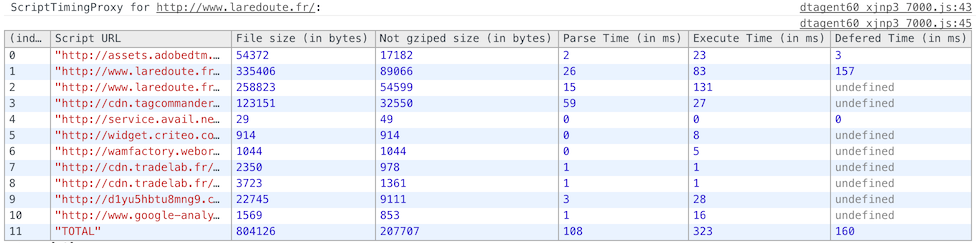

# ScriptTimingProxy

Mesure scripts parse and execution time with this simple browser proxy


## Why should you use ScriptTimingProxy ?

You're a web developer and you probably wonder what's the impact of the scripts you load when the page loads.
And it's hard to know. Even more if it's a weird minified third-party script!


## How does it work ?

1. The proxy intercepts incoming javascript files.
2. The content of the script is injected into an eval() function, so we can measure the parse time (not exactly the same, but close).
3. The execution time is measured too.
4. When the script defers some execution (setTimeout / domReay / page loaded), it is still measured!
5. The results are sent to the console.

It's totally inspired by a brilliant idea from Daniel Espeset (Etsy): [http://talks.desp.in/unpacking-the-black-box/](http://talks.desp.in/unpacking-the-black-box/)


### Be careful, the proxy is not working with HTTPS files. It doesn't even tunnel them.

*(If you know how to fix this, please give me your advice)*

On Firefox, i did not manage to set-up an **HTTP only** proxy, so **any HTTPS page or HTTPS ressource will be blocked**.
It is possible with Chrome (on Mac), so HTTPS requests will just bypass the proxy and their timings won't be available.


## Installation

```bash
npm install script-timing-proxy -g
```

## Use

1. Start the server: `script-timing-proxy`

2. Configure your browser's proxy to `localhost:3838`

3. Open your browser's console and load the page

4. The script will wait **5 seconds after the last script is loaded** before printing to the console.


## Results

For the best output, choose Chrome's console or Firebug (not FF's console).



For somes pages, you will see multiple tables: one for each iFrame.


## Author
Gaël Métais. I'm a webperf freelance based in Paris. If you understand french, you can visit [my website](http://www.gaelmetais.com).
